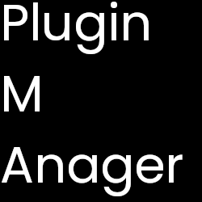

# PMA
Plugin MAnager for Vizality/Powercord
# What is this?
This is a Plugin manager (like a package manager, but for plugins and themes) for linux systems that is compatible with Powercord and Vizality.

# How do i use this?
1. Clone the repo
2. edit the THEMEDIR and DIR using your favorite text editor (vim, nano, micro, etc.)
3. run chmod +x pma
4. run bash pma or ./pma 

# What are the commands?
you can check the available commands using the `pma -h` command

#I ran it, nothing happened.Why?
You need to run `pma -h` to see the commands and use it

# What are the advantages of pma?
Well there are couple of advantages
1. Fast - Its much faster than getting plugins manually
2. Simple - Even a baby can understand it 
3. Customizable - Since its just a shell script, everyone can customize it without much knowledge!

# How can i install themes with this?
For now you **cant**

# Can i use this on Windows?
You can use this under wsl, if you point the dir to vizality folder through /mnt/c/.
Still not supported though as i dont run a windows machine.

# Im getting jq/git/curl command not found errors, how can i fix them?
You need to install jq/git/curl to use pma.

# Why are you using shell and not this [random programming language] instead?
shell is fast and easy to learn/modify, and it makes my job easier.

# License
pma is licensed under MIT license.
